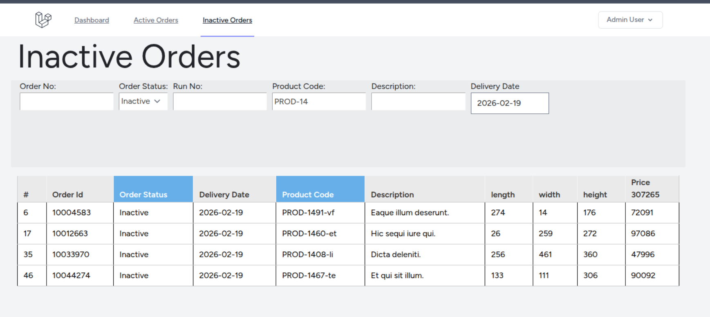

## Laravel 12 + Livewire 3 – Demo Application with `wire:navigate`, `#[Lazy]`, TableFilter JS and Flatpickr



This demo application showcases practical usage of `wire:navigate` and `#[Lazy]` in Livewire 3/4, combined with the TableFilter JS component and the flatpickr date picker.
The project demonstrates how to solve the common issue of 
Livewire components reloading on date change or filter updates and switching between pages.


It serves as an educational example for developers who want to understand how to integrate Livewire 
with JavaScript tools efficiently and how to optimize component rendering and navigation.

## Learning Laravel


| Technology / Tool  | Purpose                                            |
|--------------------|----------------------------------------------------|
| Laravel 12         | Backend, routing, application logic                |
| Livewire 3         | Interactive components, `wire:navigate`, `#[Lazy]` |
| TableFilter JS     | Client‑side table filtering                        |
| flatpickr          | Lightweight date picker                            |
| TailwindCSS        | UI styling                                         |
| Vite               | Asset bundling                                     |


## Installation

```
composer install
cp .env.example .env
php artisan key:generate
sail build --no-cache
sail up -d
sail shell
php artisan migrate:fresh -seed
```
| Login           | Password |
|-----------------|----------|
| admin@admin.com | password |

## Contributing
Pull requests and issue reports are welcome.

## License
MIT — feel free to use, modify, and learn from this project.

## Links
[Table Filter](https://www.tablefilter.com/)
[flatpickr](https://flatpickr.js.org/)

